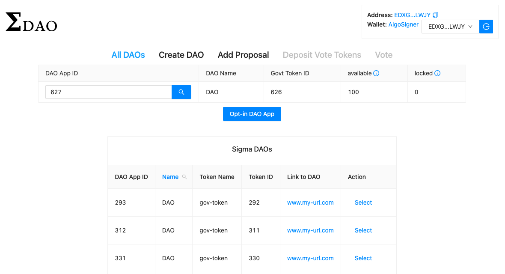
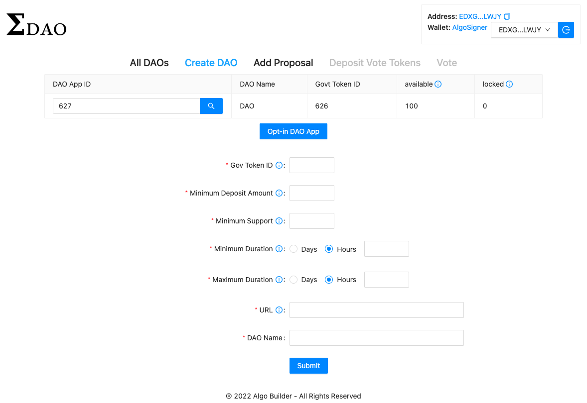
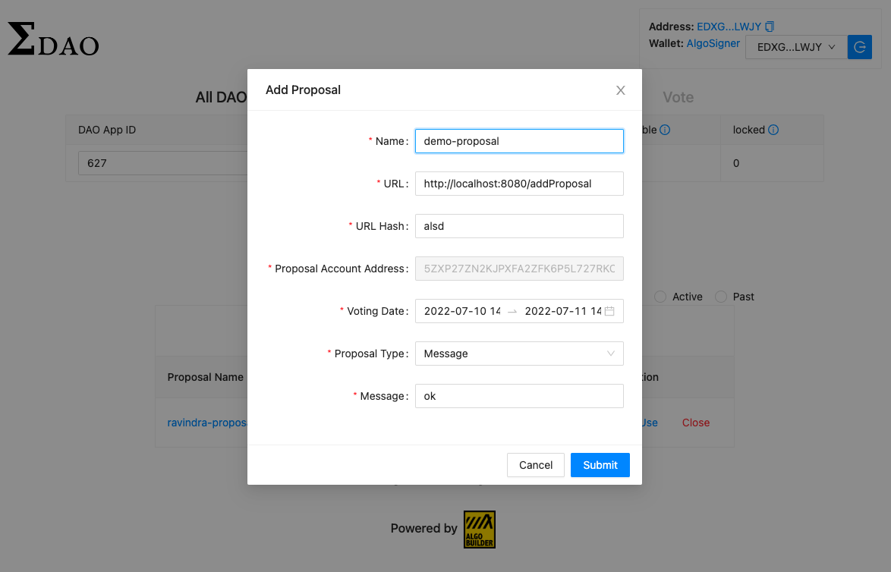

# SigmaDAO

SigmaDAO is a web application that lets anyone create a DAO, enable them to Add Proposal, Deposit and Withdraw Tokens and also allow them to Vote.

Wallets supported by the SigmaDAO are:

- [AlgoSigner](https://www.purestake.com/technology/algosigner/)
- [MyAlgo Wallet](https://wallet.myalgo.com/new-account)
- [Wallet Connect](https://walletconnect.com/)

## SigmaDAO glimpes:

Home page of SigmaDAO. All daos are listed on this page, where user can select a DAO.



Create DAO page of SigmaDAO. On this page user can create a DAO.



Add proposal page of SigmaDAO. On this page user can add a proposal on a existing DAO.



## Requirements

- Node version >=14.11.0
- yarn 3.2
- PostgreSQL >= 12

## Setup

This section demonstrates the end-to-end setup required to run the SigmaDAO application fully functioning.

### How to setup postgres?

Download and install the postgres version >= 12 from [here](https://www.postgresql.org/download/).

### How to setup sigmada-indexer?

1. Clone [sigmadao-indexer](https://github.com/scale-it/sigmadao-indexer) repo.
2. Install go version 1.17 from [here](https://go.dev/dl/).
3. Build the sigmadao-indexer project:

```bash
make
```
4. Please make sure postgres server is running.
5. Sigmadao-indexer can be run on any network using below command:

```bash
cmd/algorand-indexer/algorand-indexer daemon --data-dir /tmp -P "host=localhost port=5432 user=<postgres-user> password=<postgres-password> dbname=<postgres-database-name> sslmode=disable" --algod-net <link-to-network> --algod-token <network-token> --genesis <path-to-genesis-file>
```
Example of sigmadao-indexer running on private-net:

```bash
cmd/algorand-indexer/algorand-indexer daemon --data-dir /tmp -P "host=localhost port=5432 user=algorand password=indexer dbname=pgdb sslmode=disable" --algod-net 127.0.0.1:4001 --algod-token aaaaaaaaaaaaaaaaaaaaaaaaaaaaaaaaaaaaaaaaaaaaaaaaaaaaaaaaaaaaaaaa --genesis ../algo-builder/infrastructure/node_data/genesis.json
```

### How to create a sigmada user and setup sigmadao with read-only permission to database?

Setup the sigma_daos table. Sigmadao-indexer should be running before executing below scripts.

Create a sigma dao user, if not already created:

    make create-sigma-dao-user

Setup sigma dao, indexer should be running before executing this script:

    make setup-sigma-dao

Run below script to delete the sigma dao user, sigma dao user should be present:

    make drop-sigma-dao-user

### How to setup sigmadao backend?

Make sure you are in /dapp directory of this project before executing below steps.

Start the development server on http://localhost:4000 configured for private-net.

```bash
yarn server:privatenet
```

Note: The above backend server is running configured for private-net network. You can configure it to MainNet, TestNet or BetaNet using below command:

```bash
yarn server:[mainnet/testnet/betanet]
```

Once, abobe backend setup is done. The backend should be running on [localhost](http://localhost:4000) which connects to PostgreSQL database. [Postgraphile](https://www.graphile.org/postgraphile/) has automatic resolver which reads the schema of table and function for auto query generation.

### How to setup SigmaDAO frontend application?

1. Install the dependecies.

```bash
yarn install
```

2. Run the server configured on private-net using below command:

```bash
yarn start:privatenet
```

Note: The above frontend server is running configured for private-net network. You can configure it to MainNet, TestNet or BetaNet using below command:

```bash
yarn start:[mainnet/testnet/betanet]
```

## Production build of SigmaDAO app

Build the application for production:

```bash
yarn build
```

Checkout the [deployment documentation](https://vuejs.org/guide/best-practices/production-deployment.html)

P.S: This is a beta software.
